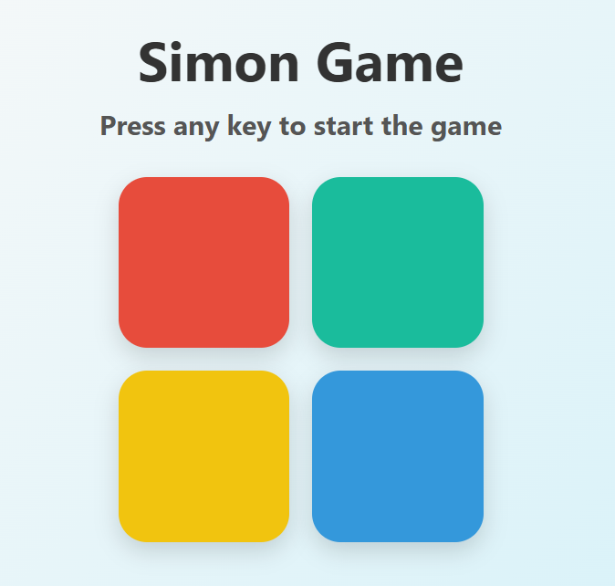

# 🎮 Simon Says Game

A fun and interactive **Simon Says memory game** built with HTML, CSS, and JavaScript. Test your memory by repeating a growing sequence of colors and sounds. How far can you go?

## 🚀 Live Demo

👉 [Play Now](https://mkg0007.github.io/Simon_Says_Game)  

---

## 🧠 Features

- 🎨 Colorful UI with sound feedback
- 🔊 Audio cues for each button
- 🔁 Increasing difficulty as levels progress
- ⚡ Responsive design for desktop and mobile
- 🔄 Restart game functionality

---

## 📸 Screenshots

| Desktop |
|--------|
| 

---

## 🛠️ Tech Stack

- HTML5
- CSS3
- JavaScript (Vanilla)

---

## 🧩 How to Play

1. Press any key to start the game.
2. Watch the color pattern that appears.
3. Repeat the pattern by clicking the colored buttons in the correct order.
4. Each new level adds an additional color to the sequence.
5. Game over if you click the wrong sequence — try again!

---

## 🧪 Run Locally

1. Clone the repo:

```bash
git clone https://github.com/MKG0007/Simon_Says_Game.git
